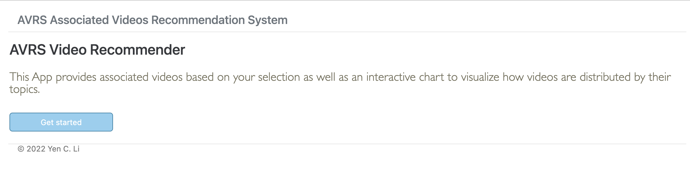
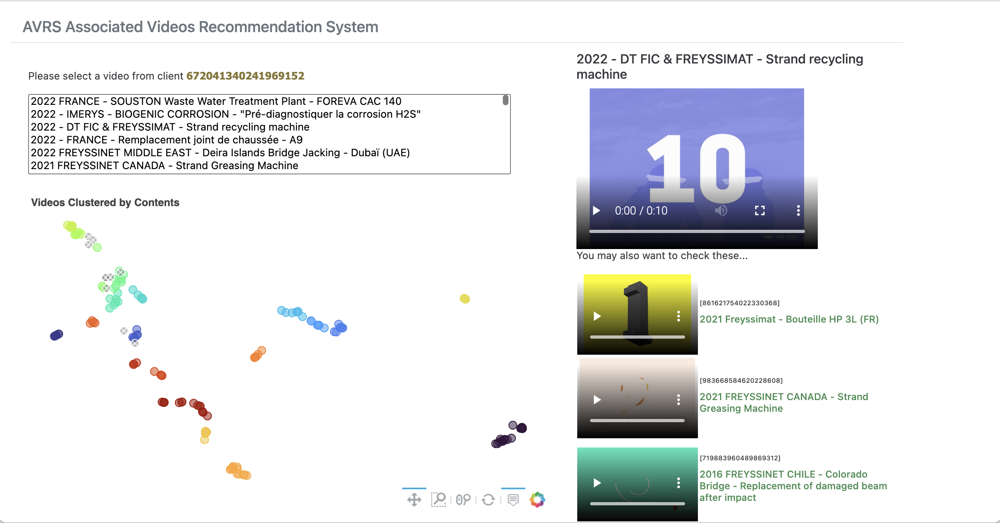

# avrs-web
AVRS Associated Videos Recommendation System

[](https://github.com/yencli/avrs-web)
[](http://perso.crans.org/besson/LICENSE.html)


<!-- PROJECT LOGO -->
<br />
<div align="center">
  <a href="https://github.com/yencli/avrs-web">
    
  </a>

  <h3 align="center">AVRS-web</h3>

  <p align="center">
    An awesome Associated Videos Recommendation System!
    <br />
    <a href="https://yencli.github.io/avrs-web"><strong>Explore the docs »</strong></a>
    <br />
    <br />
    <a href="https://drive.google.com/file/d/1uOcU_qirs1BXfuds_xunhpAI7gT6xTFt/view?usp=sharing">View Demo</a>
    ·
    <a href="https://github.com/yencli/avrs-web/issues">Report Bug</a>
    ·
    <a href="https://github.com/yencli/avrs-web/issues">Request Feature</a>
  </p>
</div>


<!-- TABLE OF CONTENTS -->
<details>
  <summary>Table of Contents</summary>
  <ol>
    <li>
      <a href="#about-the-project">About The Project</a>
      <ul>
        <li><a href="#built-with">Built With</a></li>
      </ul>
    </li>
    <li>
      <a href="#getting-started">Getting Started</a>
      <ul>
        <li><a href="#prerequisites">Prerequisites</a></li>
        <li><a href="#installation">Installation</a></li>
      </ul>
    </li>
    <li><a href="#usage">Usage</a></li>
    <li><a href="#roadmap">Roadmap</a></li>
    <li><a href="#contributing">Contributing</a></li>
    <li><a href="#license">License</a></li>
    <li><a href="#contact">Contact</a></li>
  </ol>
</details>


<!-- ABOUT THE PROJECT -->
## About The Project

[](https://github.com/yencli/avrs-web)

This App provides associated videos based on your selection as well as an interactive chart to visualize how videos are distributed by their topics.


<p align="right">(<a href="#readme-top">back to top</a>)</p>


### Built With

* [](https://www.python.org/)
* [](https://flask.palletsprojects.com/)


<p align="right">(<a href="#readme-top">back to top</a>)</p>


<!-- GETTING STARTED -->
## Getting Started

Please make sure that all the necessary packages have been installed.

### Prerequisites

Please install all the necessary packages before running the program. You may run either by setup.py or via pip install

* setup.py
  ```sh
  python setup.py install
  ```


You may also just install all the necessary package without install avrs-web as package.

* pip
  ```sh
  pip install -r requiement.txt
  ```

### Installation

Here are the steps to follow to install avrs-web:

1. Clone the repo
   ```sh
   git clone https://github.com/yencli/avrs-web.git
   ```
2. Install  packages
   ```sh
   python setup.py install
   ```
3. Enter your DB address in `config.ini`, you may left it blank if there's no specific folders for the files.
   ```js
   DATA_DIR: 'ENTER YOUR DB ADDRESS';
   EMBED_FOLDER: 'ENTER FOLDER NAME FOR EMBEDDED DATA';
   RESULT_FOLDER: 'ENTER FOLDER NAME FOR CLUSTERING DATA';
   ```
4. Enter your filename in `config.ini`
   ```js
   cid: 'ENTER YOUR FILENAME';
   ```


<p align="right">(<a href="#readme-top">back to top</a>)</p>


<!-- USAGE EXAMPLES -->
## Usage

You may run on the example data provided here simply by executing the script run-app.py.

* run-app.py
  ```sh
  python tests/run-app.py
  ```

or you may try with your own data by configurating config.ini then run with:

* main.py
  ```sh
  python main.py
  ```


The documentation is distributed with avrs-web source code in the docs/ directory.

_For more examples, please refer to the [Documentation](https://yencli.github.io/avrs-web/)_

<p align="right">(<a href="#readme-top">back to top</a>)</p>


<!-- ROADMAP -->
## Roadmap

- [ ] Add pytest
- [x] Add Documentation
- [ ] Add User-based data to content

See the [open issues](https://github.com/yencli/avrs-web/issues) for a full list of proposed features (and known issues).

<p align="right">(<a href="#readme-top">back to top</a>)</p>


<!-- CONTRIBUTING -->
## Contributing

Contributions are what make the open source community such an amazing place to learn, inspire, and create. Any contributions you make are **greatly appreciated**.

If you have a suggestion that would make this better, please fork the repo and create a pull request. You can also simply open an issue with the tag "enhancement".
Don't forget to give the project a star! Thanks again!

1. Fork the Project
2. Create your Feature Branch (`git checkout -b feature/AmazingFeature`)
3. Commit your Changes (`git commit -m 'Add some AmazingFeature'`)
4. Push to the Branch (`git push origin feature/AmazingFeature`)
5. Open a Pull Request

<p align="right">(<a href="#readme-top">back to top</a>)</p>


<!-- LICENSE -->
## License

Distributed under the GNU General Public License V3. See `LICENSE.txt` for more information.

<p align="right">(<a href="#readme-top">back to top</a>)</p>


<!-- CONTACT -->
## Contact

Yen C. Li  - yencli@outlook.com

Project Link: [https://github.com/yencli/avrs-web](https://github.com/yencli/avrs-web)

<p align="right">(<a href="#readme-top">back to top</a>)</p>
